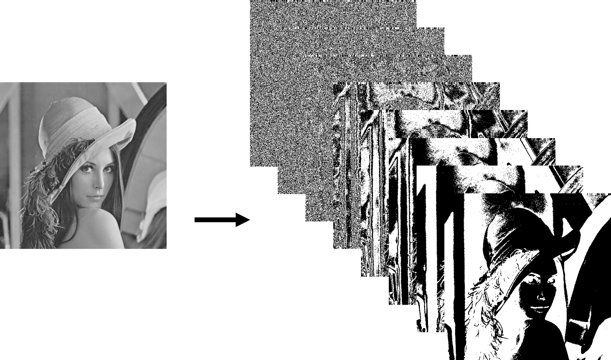
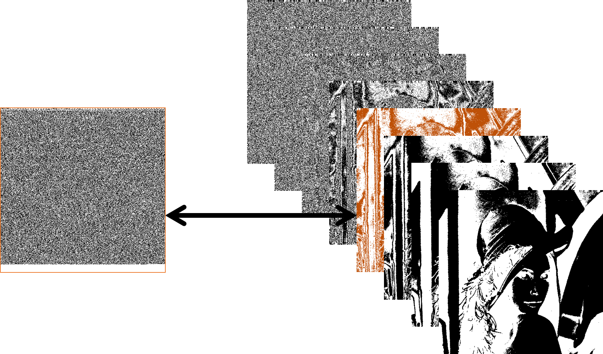
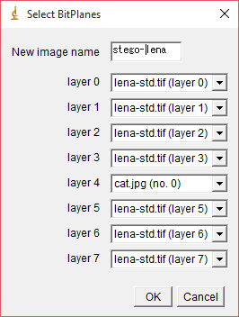

#Tutorial(English)
もし日本語で閲覧したい場合は、こちらの[日本語のチュートリアル](./Japanese.md)を参照してください。


##1. Install software
Please download the one that corresponds to the OS you're using from the following URL.

I am using the ImageJ in this tutorial.
Fiji is the software that was more equipped with a standard plug-in ImageJ.

* ImageJ Download
https://imagej.nih.gov/ij/download.html

* Fiji Download
http://imagej.net/Fiji/Downloads


##2. Installation the plug-in
Please you exec ```git clone https://github.com/Y-Ichioka/DigitalWatermarkPlugins.git```.
Or please download the repository from the browser.
Then, put the DigitalWatermark directory into the plugins directory on the software. **(Not a DigitalWatermarkPlugins)**

After installation of the plug-in, directory structure should look like the following.

```
plugins
├─Analyze
├─Examples
├─JRuby
├─Macros
├─Scripts
├─Utilities
└─DigitalWatermark <= new
  ├─*.class
  └─*.java
```

After the re-start the software, Software can exec any processing by clicking the button on the menu (*Plugins*->*DigitalWatermark*).

##3. Bit substitution method
As an example, I introduce processing of the image digital watermark using the plug-in.
This is by using bit substitution method, embed the data into a gray scale image.

###Embedded processing

####1. Convert to bit plane
Convert the image to [bit plane](https://en.wikipedia.org/wiki/Bit_plane).

1. Prepare the image (*File*->*Open Samples*->*Lena (68K)*)
2. Convert the image to 8-bit gray scale image (*Image*->*Type*->*8-bit*)
3. Convert to bit plane (*Plugins*->*DigitalWatermark*->*GrayScale to BitPlanes*)



####2. Convert the embedding data to bit planes
1. Convert the embedding data to bit planes (*Plugins*->*DigitalWatermark*->*File to BitPlanes*)


As an example, I am using the sample/cat.jpg (249,800 [bit]).
You can embed width×height[bit] information per one bit plane.

####3. Converting the bit plane to gray scale image
1. Convert to gray scale image (*Plugins*->*DigitalWatermark*->*BitPlanes to GrayScale*)
2. Save the image that was embedded (*File*->*Save*)




Insert the previous data (bit-plane) to any of the layers.




###Extraction process

####1. Convert to bit plane
1. Read an image that was embedded (*File*->*Open...*)
2. Convert to bit plane (*Plugins*->*DigitalWatermark*->*GrayScale to BitPlanes*)


####2.　Extract data from any of the bit-plane
1. Activate by clicking on the bit plane was embedded
2. Convert to file data (*Plugins*->*DigitalWatermark*->*BitPlane to File*)


If if you are named "*.jpg" to image when you save the image, the image will be displayed correctly.


##4. Other plug-ins
Please refer to [documentation](../documentation) for details of other plug-ins was not used in Section 3.
Or please refer to the source code of Java.


##5. Video reading and writing
###Read
Software reads the video by clicking the button on the menu (*File*->*Open...*).(This operation is possible in either ImageJ and Fiji)

Software that can read the video is limited to AVI format of JPEG or PNG or no compression.
You can convert any videos to AVI format uncompressed by executing the following command by using [FFmpeg](https://www.ffmpeg.org/)

```
ffmpeg -i input.mp4 -an -vcodec rawvideo -y output.avi
```

###Write
If you are using the Fiji, software writes the video by clicking the button on the menu (*Plugins*->*Bio-Formats*->*Bio-Formats Exporter*).

If you are using ImageJ, you need to install [Bio-Formats](http://imagej.net/Bio-Formats) plug-in to ImageJ.
After installation plug-in, you can do the writing in the same procedure as described above.


##6. Macros and plug-ins
It is easy to create a macro on ImageJ and Fiji.
As an example, it is useful to use a macro when performing an evaluation for  multiple images.

In addition, you are a possible use of OpenCV to create plug-ins, you can use the Python in Fiji.

##7. Recommended plug-ins
I introduce plug-ins that is useful when performing the processing of the image or video digital watermark.

* IJ Plugins Toolkit
http://ij-plugins.sourceforge.net/plugins/toolkit.html

* Discrete Cosine Transform (DCT)
https://imagej.nih.gov/ij/plugins/dct.html

* Calculate MS-SSIM AND MS-SSIM* Indexes
https://imagej.nih.gov/ij/plugins/mssim-index.html

* Calculate SSIM Index
https://imagej.nih.gov/ij/plugins/ssim-index.html
