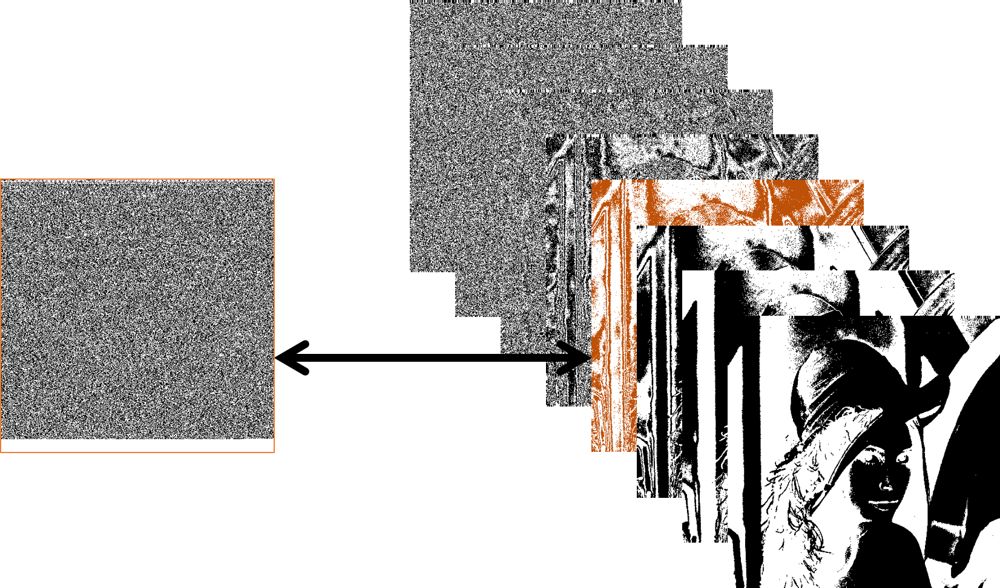
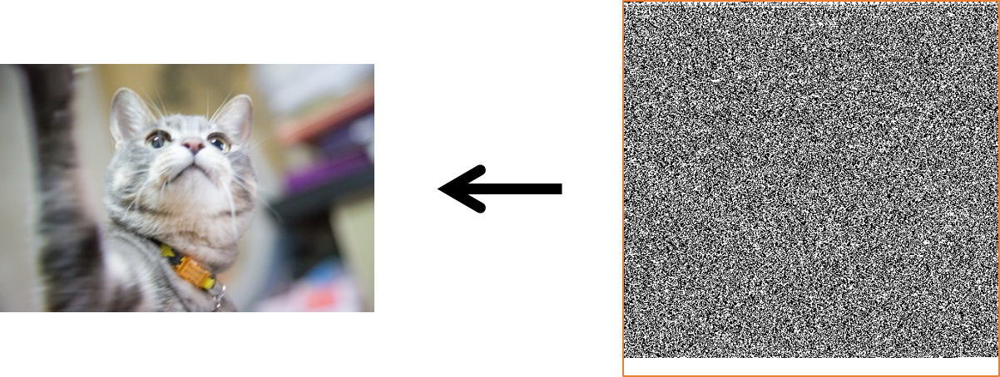

#チュートリアル(日本語)
If you want to browse page written in English, please refer to the [English tutorial page](./English.md).


##1. ソフトの導入
以下のURLから使用しているOSに対応したものをダウンロードしてください。

今回のチュートリアルでは簡潔するためにImageJを用います。
FijiはImageJに標準プラグインなどをより多く搭載したソフトです。

* ImageJ Download
https://imagej.nih.gov/ij/download.html

* Fiji Download
http://imagej.net/Fiji/Downloads


##2. プラグインの導入
```git clone https://github.com/Y-Ichioka/DigitalWatermarkPlugins.git```するかブラウザ上からリポジトリをダウンロードしてください。
その後ソフト上のpluginsディレクトリの中にDigitalWatermarkディレクトリを入れて下さい。**(DigitalWatermarkPluginsではありません)**
以下のようなディレクトリ構造になります。

```
plugins
├─Analyze
├─Examples
├─JRuby
├─Macros
├─Scripts
├─Utilities
└─DigitalWatermark <= new
  ├─*.class
  └─*.java
```

ソフトを再起動後、メニュー上のボタンの*Plugins*->*DigitalWatermark*から任意の処理を行えます。


##3. ビット置換法を行ってみる
例として実際にプラグインを使用して画像電子透かしを行います。
ビット置換法を用いてグレースケール画像にデータの埋め込みを行います。

###埋め込み処理

####1. 画像をビットプレーンに変換
画像を[ビットプレーン](https://ja.wikipedia.org/wiki/%E3%83%93%E3%83%83%E3%83%88%E3%83%97%E3%83%AC%E3%83%BC%E3%83%B3)に変換します。

1. 画像を用意 (*File*->*Open Samples*->*Lena (68K)*)
2. 画像を8-bitのグレースケールに変換 (*Image*->*Type*->*8-bit*)
3. ビットプレーンに変換 (*Plugins*->*DigitalWatermark*->*GrayScale to BitPlanes*)


####2. 埋め込むデータをビットプレーンに変換
1. データをビットプレーンに変換　(*Plugins*->*DigitalWatermark*->*File to BitPlanes*)


ここでは例としてsample/cat.jpg(249,800[bit])を用います。
1枚のビットプレーンに画像の横幅×画像の立幅[bit]分のデータを埋め込むことができます。

####3. ビットプレーンを画像に変換
1. ビットプレーンに変換 (*Plugins*->*DigitalWatermark*->*BitPlanes to GrayScale*)
2. 埋め込みを行った画像を保存 (*File*->*Save*)




任意の層に先ほどのデータ(ビットプレーン)を挿入します。


###抽出処理

####1. 画像をビットプレーンに変換
1. 埋め込みを行った画像を読み込み (*File*->*Open...*)
2. ビットプレーンに変換 (*Plugins*->*DigitalWatermark*->*GrayScale to BitPlanes*)


####2.　任意のビットプレーンからデータを抽出
1. 埋め込みを行ったビットプレーンをクリックしてアクティブにする
2. ファイルに変換 (*Plugins*->*DigitalWatermark*->*BitPlane to File*)



保存時に"*.jpg"と命名すれば、正しく画像が表示されます。


##4. その他プラグイン
3節で用いなかったその他のプラグインの詳細は[ドキュメント](../documentation)を参照してください。


##5. 動画の読み込み、書き出し
###読み込み
メニュー上のボタンの*File*->*Open...*から行えます。(ImageJ, Fijiどちらでも可)

読み込みが可能な動画はJPEG、PNG圧縮か無圧縮のAVI形式に限られます。
[FFmpeg](https://www.ffmpeg.org/)を用いて以下のコマンドを命令することにより、無圧縮のAVI形式に変換することができます。

```
ffmpeg -i input.mp4 -an -vcodec rawvideo -y output.avi
```

###書き出し
Fijiの場合、メニュー上のボタンの*Plugins*->*Bio-Formats*->*Bio-Formats Exporter*から行うことができます。

ImageJの場合[Bio-Formats](http://imagej.net/Bio-Formats)プラグインを導入する必要があります。
プラグイン導入後、上記と同様に書き出しを行うことができます。


##6. マクロとプラグイン
ImageJ,Fijiではマクロの作成が容易に行えるため、複数画像に対する評価などはマクロを用いると便利です。

プラグインにはOpenCVを用いることが可能であったり、FijiではPythonを使用できます。


##7. おすすめのプラグイン
画像、動画電子透かしを行う際に使える便利なプラグインを紹介します。

* IJ Plugins Toolkit
http://ij-plugins.sourceforge.net/plugins/toolkit.html

* Discrete Cosine Transform (DCT)
https://imagej.nih.gov/ij/plugins/dct.html

* Calculate MS-SSIM AND MS-SSIM* Indexes
https://imagej.nih.gov/ij/plugins/mssim-index.html

* Calculate SSIM Index
https://imagej.nih.gov/ij/plugins/ssim-index.html
